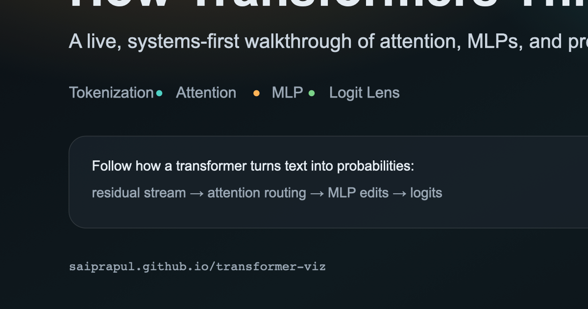

# How Transformers Think

A live, systems-first walkthrough of how transformer models turn text into predictions.
Explore tokenization, attention routing, MLP edits, the residual stream, and the logit lens
through interactive modules designed for long-form reading.

## Live site

https://saiprapul.github.io/transformer-viz/

## Preview



## What is this?

This is a single-page, frontend-only experience that teaches inference in transformers.
It focuses on clarity and pacing: narrative explanations first, optional deep dives second.

## Who is this for?

- Builders who use LLMs and want a systems-level mental model
- Designers or PMs who need a clear explanation without reading papers
- Engineers who want to connect math terms to visual intuition

## What you’ll get out of it

- A concrete, step-by-step picture of how next-token prediction works
- Intuition for why attention and MLPs play different roles
- A clearer mental model of the residual stream and why depth matters
- A practical feel for how small text edits shift probabilities

## Highlights

- Guided run to step through the narrative
- Compare mode for side-by-side sentence analysis
- Forensic breakdown of the final prediction
- Visuals for attention, MLP activity, and residual edits

## Tech stack

- React + Vite + TypeScript
- Tailwind CSS
- Framer Motion

## Local development

```bash
npm install
npm run dev
```

## Build

```bash
npm run build
npm run preview
```

## Deploy (GitHub Pages)

This repo is configured to deploy via GitHub Actions to GitHub Pages.
The Vite base path is set to `/transformer-viz/` for project-page hosting.

## Notes

- No backend required.
- Designed for a 20–30 minute reading experience.

## Quick glossary

- **Token**: The model’s internal unit of text (often a subword).
- **Embedding**: The vector representation of a token.
- **Residual stream**: The running vector state that layers edit.
- **Attention**: A routing mechanism that mixes context from other tokens.
- **MLP**: A per-token transformation that reshapes meaning.
- **Logit**: The raw score for a candidate next token before softmax.

## Acknowledgements

Inspired by the paper "Attention Is All You Need."
